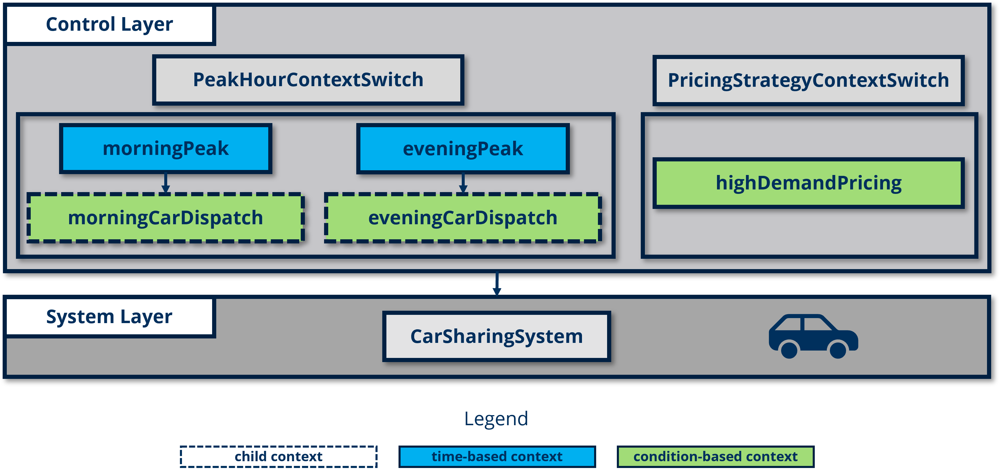

# CarSharingSystem

This case study demonstrates how the **CoPN** can be used to implement modular and maintainable control logic within a car-sharing system. The model enables dynamic control of car dispatch and pricing based on contextual factors such as peak hours and user demand. Time-based and event-based conditions have been used for enhancing flexibility without modifying the core system model.

The structure of the case study is organized as follows:

```
CarSharingSystemCaseStudy      
├── CarSharingSystem                  
├── PeakHoursContextSwitch
├── PricingStrategyContextSwitch
└── CarSharingSystemCaseStudy
```

- **CarSharingSystem**: The base car-sharing system model, adapted with connectors to integrate control layers.
- **PeakHoursContextSwitch**: A control module to dispatch cars based on peak hours using time-based and condition-based context events.
- **PricingStrategyContextSwitch**: A control module to dynamically adjust pricing based on user demand.
- **CarSharingSystemCaseStudy**: The integration model that connects the control modules with the base car-sharing system.

As illustrated in the diagram below, this case study includes five contexts: three condition-based contexts and two time-based contexts. Two of the condition-based contexts are children contexts of the time-based contexts.



## Modules
### Module 1: CarSharingSystem

The **CarSharingSystem** model with 2824 variables and equations is based on an open-source car-sharing system repository, available [here](https://git-st.inf.tu-dresden.de/wang/pn4ecss). To integrate control logic, two input and output connectors are added for interfacing with the control layers, while other components remain unchanged.

### Module 2: PeakHoursContextSwitch

The **PeakHoursContextSwitch** module introduces both time-based and condition-based context events to control car dispatching during peak hours. The model activates different contexts based on defined morning and evening peak hours and adjusts car availability when the current number of cars falls below a threshold. 

In this setup, during peak hours, if `currentNumCars` falls below a certain level, cars are dispatched to meet demand. The remaining implementation is shown below:

### Module 3:  PricingStrategyContextSwitch

The **PricingStrategyContextSwitch** module uses a condition-based context event to dynamically adjust pricing based on user demand. When user numbers exceed a defined threshold, the system switches to a higher pricing strategy.

The complete model adjusts pricing based on the active context, as shown below:

### Module 4: CarSharingSystemCaseStudy

This integration model combines the **CarSharingSystem** model with the **PeakHoursContextSwitch** and **PricingStrategyContextSwitch** control modules. By connecting these modules, the car-sharing system can respond dynamically to peak hour demands and adjust pricing based on user demand without modifying the original system model.