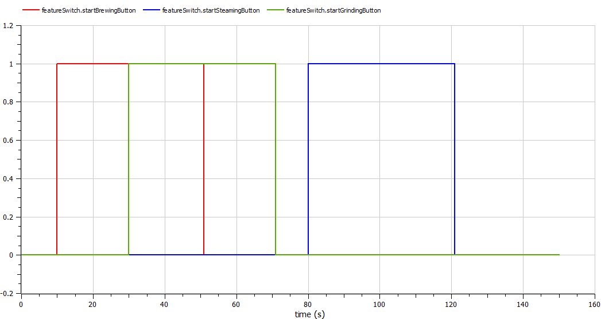
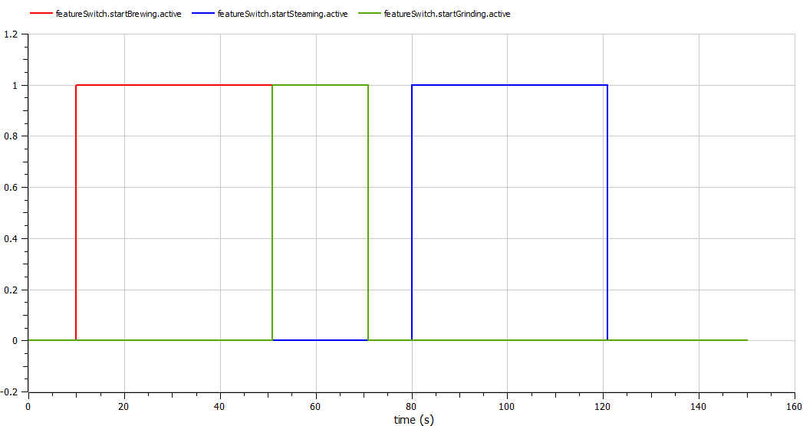

# CoffeeMaker

This example simulates a coffee maker with three main functions—brewing, grinding, and steaming—each operating as distinct **features** within the system.

## Components

- **UserAction**: Simulates user inputs (button presses) that activate each feature for specific time durations.
- **FeatureSwitch**: Uses feature-based transitions to ensure each feature runs independently, avoiding conflicts. For example, grinding and steaming cannot run simultaneously due to exclusive activation.
  - **Feature 1**: Brewing
  - **Feature 2**: Grinding
  - **Feature 3**: Steaming
- **CoffeeMaker**: The main integration model that brings together the components to simulate a functioning coffee maker with independent and exclusive feature management.

## Result

When the button for the corresponding function (feature) is pressed, the process starts. The system also handles conflicts, for example, if the brewing process is ongoing and the button for steaming is pressed, the system will wait until the brewing process finishes before starting the steaming process.

