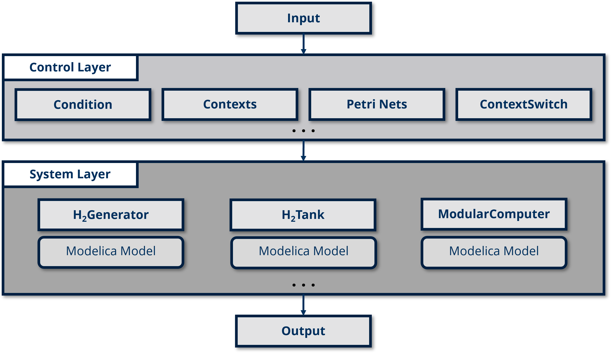
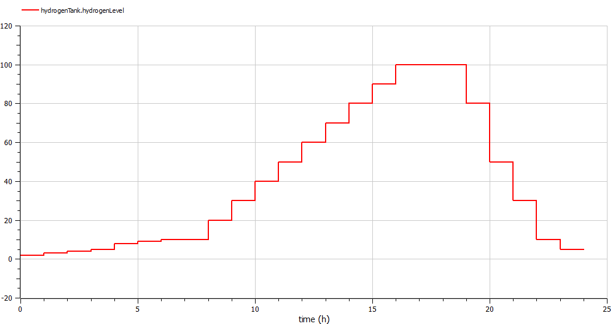
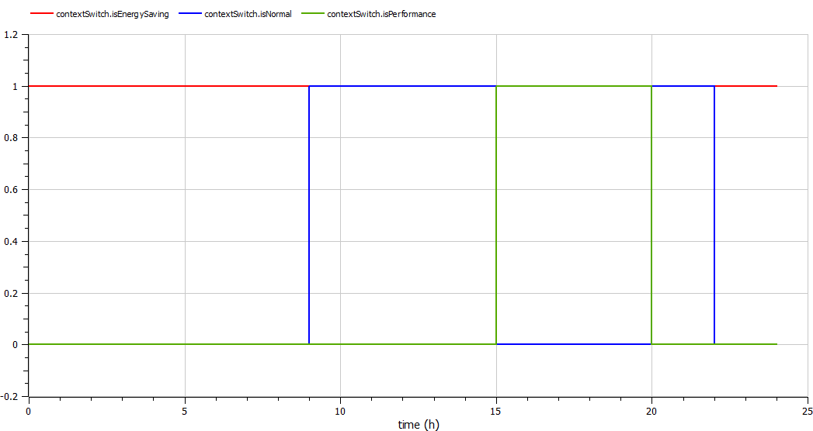
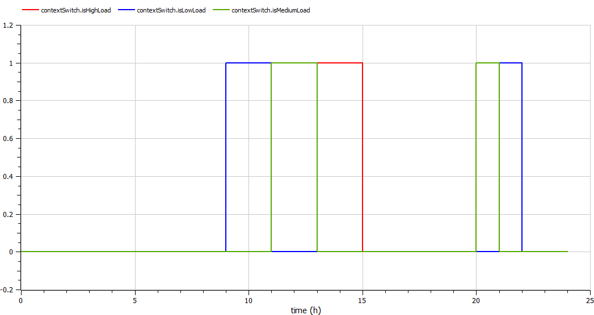

# GreenIT

This example models an energy-efficient system that manages power generation and usage based on hydrogen levels. It dynamically switches between different contexts to optimize energy use for a modular computer system.

## Components

- **HydrogenGenerator**: Produces hydrogen based on pre-defined production rates.

- **HydrogenTank**: Stores the generated hydrogen and monitors the current hydrogen level available for usage.

- **ModularComputer**: Consumes hydrogen-based electricity based on different operational modes (energy-saving, normal, and performance) and adjusts power consumption according to hydrogen availability.

- **ContextSwitch**: Manages context switching for the system based on hydrogen levels:
  - **Energy-Saving Mode**: Activated when hydrogen levels are low, minimizing power consumption.
  - **Normal Mode**: Enabled when hydrogen levels are moderate.
    - **Nested Load Levels**: (Low, Medium, High) adjust power usage within the performance mode.
  - **Performance Mode**: Engaged when hydrogen levels are high, allowing for maximum power consumption.

- **GreenIT**: The main integration model that coordinates all components, simulating an energy-efficient IT system.

Below is the complete control logic in the **Control Layer**, with the underlying Petri Nets fully hidden from the modeler’s view.

## Result

Based on the available hydrogen level, the IT system adapts itself to different operational modes (energySavingMode, normalMode, and performanceMode). Within normalMode, the system further adapts to different load scenarios (LowLoad, MediumLoad, HighLoad).

