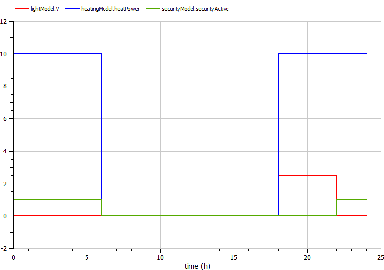

# SmartHome

In this example, the **light**, **heating**, and **security** modules in a smart home operate differently based on the active **context**: "day," "evening," or "night."

## Components

- **LightModel**: Adjusts lighting based on the time of day.
- **HeatingModel**: Turns on the heating system in "evening" or "night" mode.
- **SecurityModel**: Activates the security system during "night" mode.
- **ContextSwitch**: Manages context-switching logic based on the time of day.
- **SmartHome**: The main integration model for the SmartHome system.

## Result

Light, heating, and security—respond dynamically to the three modes (contexts): "day," "evening," and "night".

