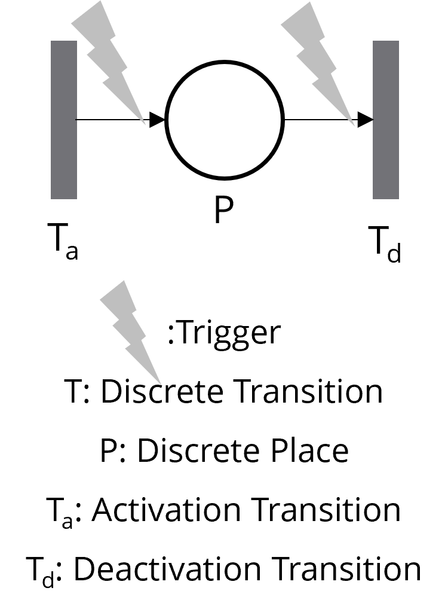
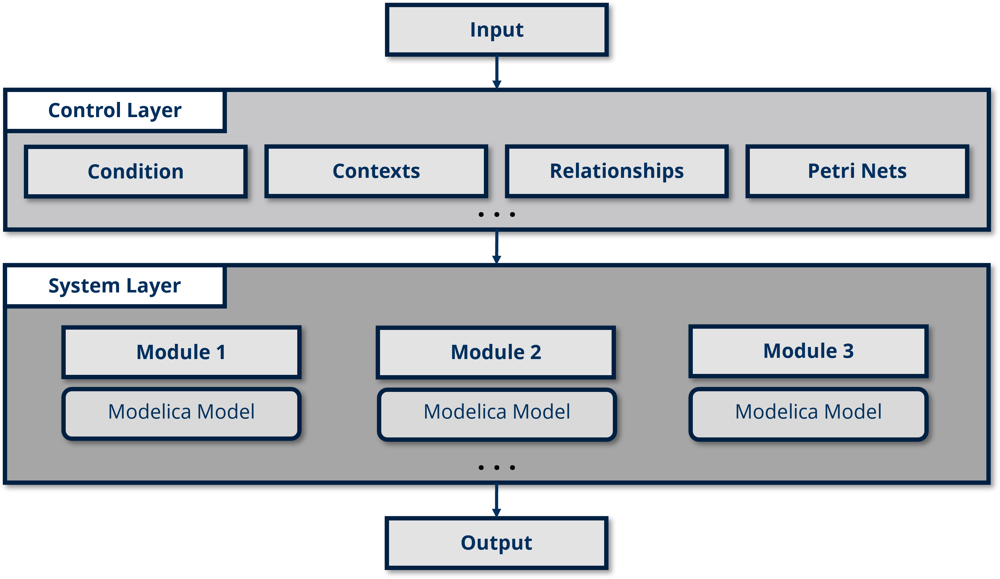

# II. CoPN
> Why not `if/else` or `when`?

Well, in small models, embedding control logic with `if/else` and `when` statements might be straightforward. However, as the number of contexts grows, this approach becomes harder to maintain and expand. Especially, defining parent-child or mutually exclusive contexts can quickly lead to a tangled mess of redundant code. While you might still be able to make sense of it after some time, others will likely struggle to understand and work with the model.

So, what if there was a simpler, cleaner, and more intuitive way to define contexts in natural language, while also supporting parent-child and mutually exclusive contexts that are easy to maintain and extend?

**CoPN** provides a solution to this problem by:

- allowing modelers to define context-specific configurations separately from the core model, enabling dynamic control of system behavior (such as energy-saving or performance modes) without altering the underlying Modelica components. This keeps the model clean, modular, and easy to maintain.

In CoPN, each context is modeled as a "Discreate Place" with activation and deactivation transitions/conditions, allowing modelers to **easily define contexts, activation and deactivation conditions, as well as context relationships**. This leads to a simpler and more manageable design.

CoPN serves as a **Control Layer** that manages system variability, leveraging modular **Petri Nets** to represent different contexts and manage state transitions. This layer dynamically configures Modelica models in the **System Layer** in response to environmental states or operational requirements. The diagram below illustrates this layered architecture, with CoPN providing adaptive control over the System Layer’s behavior.

## Model Checking

You can verify the generated Modelica code of CoPN either by running model checking in a Modelica compiler or by exporting it to standard Petri Nets and using model checking tools such as LoLA.