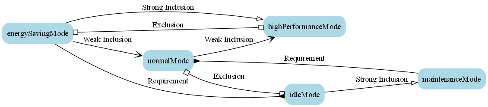

# V. CoPNCompositor

Time is money! You don’t need to define, connect, and verify everything manually, which is a pure waste of time.
With `CoPNCompositor`, you can simply define the contexts and their relationships using natural languages. Both time-based and event-based conditions can be specified for activation and deactivation. Once defined, the corresponding Modelica code will be generated automatically.

```python
"""Example usage."""
# Define contexts and relations
contexts = ["energySavingMode", "normalMode", "highPerformanceMode", "idleMode", "maintenanceMode"]

weak_inclusions = [
    ("energySavingMode", "normalMode"),
    ("normalMode", "highPerformanceMode")
]
    
strong_inclusions = [
    ("idleMode", "maintenanceMode"),
    ("energySavingMode", "highPerformanceMode")
]
    
exclusions = [
    ["energySavingMode", "highPerformanceMode"],
    ["normalMode", "idleMode"]
]
    
requirements = [
    ("energySavingMode", "idleMode"),
    ("maintenanceMode", "normalMode")
]
    
event_definitions = {
    "energySavingMode": {
        "activation_time": "{1, 3}",
        "deactivation_time": "{6}"    
    },
    "normalMode": {
        "activation_time": "{2, 4}",
        "deactivation_time": "{8}"
    },
    "highPerformanceMode": {
        "activation_time": "{5}",
        "deactivation_time": "{10, 12}"
    },
    "idleMode": {
        "activation_time": "{7}",
        "deactivation_time": "{11}"
    },
    "maintenanceMode": {
        "activation_time": "{9}",
        "deactivation_time": "{13, 14}"
        # "activation_condition": "HydrogenLevel > 10"
        # "deactivation_condition": "HydrogenLevel < 5"
    }
}
```

Additionally, you have the option to generate diagrams to visualize the contexts and their relationships.


