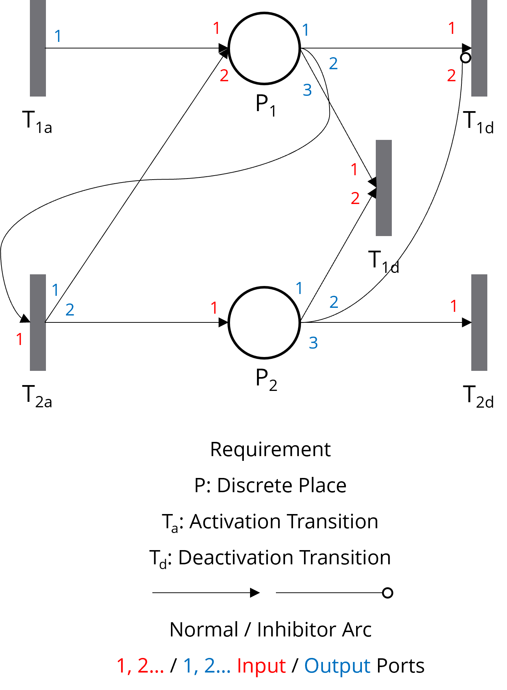
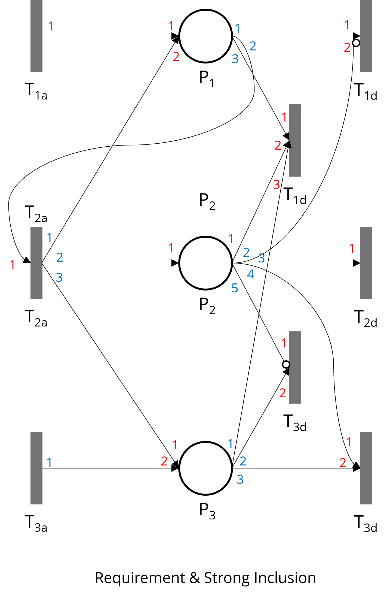

# III. Context Relationships

In complex systems, components often depend on each other. With CoPN, these relationships could also be reflexed through ingenious design and the use of inhibitor arcs.

## 1. Weak Inclusion

The activation/deactivation of **Source Context (P1)** also activates/deactivates **Target Context (P2)**, but **Target Context (P2)** retains the freedom to activate or deactivate independently.

## 2. Strong Inclusion

The activation/deactivation of **Source Context (P1)** or **Target Context (P2)** also activates/deactivates the other, but **Target Context (P2)** retains the freedom to activate or deactivate independently.

## 3. Exclusion

Two contexts cannot be active simultaneously, where activating one context will automatically deactivate the other.

## 4. Requirement

The activation of **Target Context (P2)** requires **Source Context (P1)** to be activated, the deactivation of **Source Context (P1)** will also deactivate **Target Context (P2)**.

## 5. Multiple Relationships

By following these principles, multiple relationships can also be defined. In fact, using these approaches, any kind of relationship can be represented.

