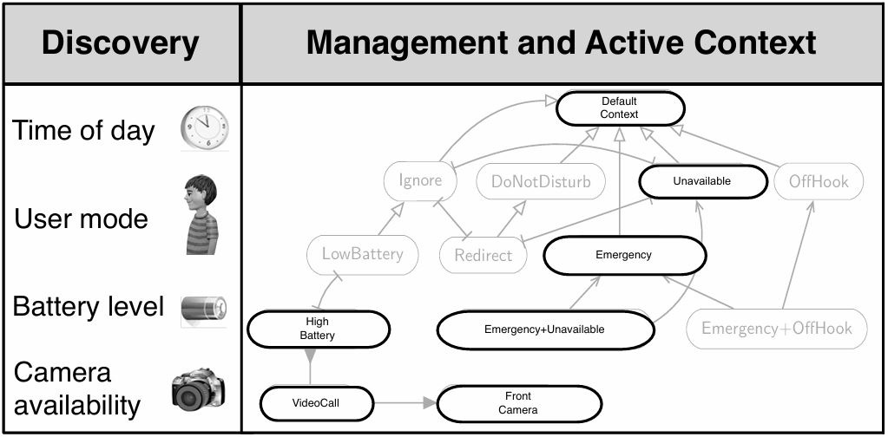

# I. Introduction

In adaptive systems, components often respond dynamically to changing contexts—whether these contexts are time-based (e.g., day and night cycles) or resource-driven (e.g., fluctuating energy availability). However, most modeling languages, including Modelica, lack support for **Context-oriented Programming (COP)**, a paradigm for modular, flexible, and adaptable system behavior. COP allows models to adapt to contexts dynamically. It simplifies context definition (e.g., `when DayMode.isActive then ...`), reducing the need for cumbersome `if/else` statements and complex `when` clauses, enabling efficient variability management.

COP allows for variability to be managed via context and its state, as shown in the following diagram from <u>Cardozo, Nicolas, et al. "Context petri nets: Definition and manipulation." (2012).</u>

The benefits of COP include:

1.  Separation of Concerns
    * COP separates core logic from context-specific adaptations, keeping components clean and focused.
2.  Modularity and Reusability
    * Components can be reused in different contexts without changes, making them flexible and adaptable.
3.  Easier Maintenance and Scalability
    * Context-specific logic is isolated, making systems easier to update and expand.
4.  Improved Readability and Understandability
    * Centralized context definitions make the code clearer and easier to understand.

However, most modeling languages do not support COP natively. **Context-oriented Petri Nets (CoPN) bridges this gap by bringing COP principles to Modelica**, enabling developers to build flexible, context-aware models with ease.